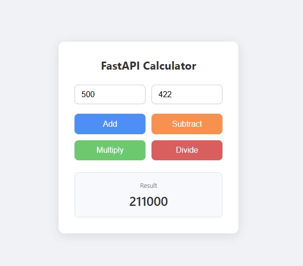
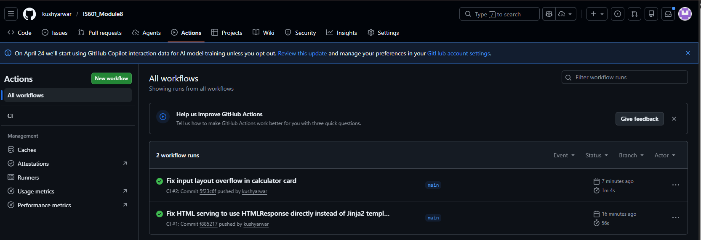

# IS601 Module 8 — FastAPI Calculator

A FastAPI-based calculator web application with unit, integration, and end-to-end tests, logging, and GitHub Actions CI.

---

## Features

- REST API built with FastAPI supporting add, subtract, multiply, and divide operations
- Clean browser-based calculator UI
- Logging throughout the application
- Comprehensive test suite (unit, integration, end-to-end)
- Automated CI via GitHub Actions

---

## Project Structure

```
IS601_Module8/
├── app/
│   ├── main.py          # FastAPI app and API endpoints
│   └── operations.py    # Calculator logic (add, subtract, multiply, divide)
├── templates/
│   └── index.html       # Browser-based calculator UI
├── tests/
│   ├── conftest.py      # Shared fixtures (live server for E2E)
│   ├── test_operations.py   # Unit tests
│   ├── test_main.py         # Integration tests
│   └── test_e2e.py          # Playwright end-to-end tests
├── .github/
│   └── workflows/
│       └── ci.yml       # GitHub Actions CI workflow
└── requirements.txt
```

---

## Setup

```bash
pip install -r requirements.txt
playwright install chromium
```

## Run the Application

```bash
python -m uvicorn app.main:app --reload
```

Open your browser at `http://127.0.0.1:8000`

---

## Running Tests

**Unit tests:**
```bash
python -m pytest tests/test_operations.py -v
```

**Integration tests:**
```bash
python -m pytest tests/test_main.py -v
```

**End-to-end tests (Playwright):**
```bash
python -m pytest tests/test_e2e.py -v
```

**All tests:**
```bash
python -m pytest -v
```

---

## API Endpoints

| Method | Endpoint | Description |
|--------|----------|-------------|
| GET | `/` | Calculator web UI |
| POST | `/add` | Add two numbers |
| POST | `/subtract` | Subtract two numbers |
| POST | `/multiply` | Multiply two numbers |
| POST | `/divide` | Divide two numbers (returns 400 on divide-by-zero) |

**Request body (all POST endpoints):**
```json
{ "a": 10, "b": 5 }
```

**Response:**
```json
{ "operation": "add", "a": 10, "b": 5, "result": 15 }
```

---

## Screenshots

### Application Running in Browser



### GitHub Actions CI — Successful Workflow Run


